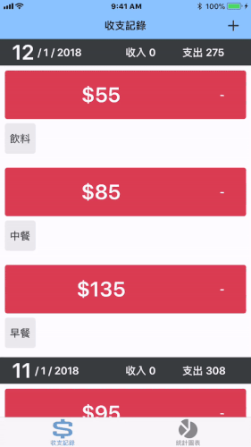

# Money Mom

## Money Mom 是什麼？

一個能讓使用者維持記帳習慣，同時也可以協助使用者做財務規劃的記帳 APP。

你覺得自己了解自己的財務狀況嗎？

先別急著回答，請先思考下列問題：

1. 近三個月每月盈餘（收入扣掉支出）是多少？
2. 如果接下來三個月沒有收入，按照過往支出習慣，後三個月餘額分別是多少？
3. 有哪些東西可以賣掉換成現金？總價值多少？
4. （如果有債務）現在分別欠哪個人多少錢？
5. 如果已知未來某天需要用到一筆錢，從現在開始每個月需存下多少錢？
6. 一年內所有已知的預期花費有多少？項目分別是什麼？

你還覺得自己了解自己的財務狀況嗎？

不要再用諸如「及時行樂」、「有收入不要透支就好」這種自欺欺人的話欺騙自己了，事實上就是懶惰、不了解、不關心、逃避自己每天都會接觸到的事。

## Money Mom 跟一般記帳軟體有什麼不一樣？

我有嘗試使用過台灣 App Store 裡面大多數的記帳軟體，包含網路上大家推薦的記帳軟體，確實，每個記帳軟體都做得很好，有完整的收支記錄，也有完整的報表顯示統計資料。

但是，不覺得少了什麼嗎？

我們完成了第一個步驟：「記帳」，但是 APP 卻沒有更近一步提供試算的功能，也沒有管理負債的功能，甚至也沒辦法記錄我的資產（股票、基金、任何有價值的物品），所以我還是得另外找工具（Excel）之類的，去做進一步的管理。

事實上，一般記帳軟體都只專注在實質金錢的收支，卻忽略資產的重要。一間公司真正的價值，不只是營收，同時也包含該公司有價值的物品。同理，一個人的價值，不只是現金，還有那個人的汽車、房契、土地等等資產。App Store 上有記帳軟體可以輕易地管理資產嗎？

如果已經有記帳的習慣，卻總還是覺得入不敷出，就是因為我們不了解自己真正的財務狀況，只看到「現金」這個財務的表面而已。

記帳僅僅是第一步而已，明確地了解財務狀況，我們才能更有效地運用錢！

Money Mom 的想法就是簡化會計知識，融入日常生活，比方說會計的專業術語「應收帳款」，其實就是一般人接案時，完成的案子，還沒有跟業主收錢，業主可能預計下個月一起轉帳，如果轉化成日常用語，就是「還沒收的錢」。

所以我必須去消化這些會計知識，思考如何轉換成一般人能理解的記帳功能，而使用者只需要維持記帳的習慣即可。我只是去參考、模仿會計的方式，而不是去實現一個會計的系統。

因此，就像會計的流程，第一步還是得先記好帳。想要維持記帳習慣，最好的方式就是簡化記帳的時間。比方說，如果有一個 APP 能讓我三秒內記得一個英文單字，那我還會覺得背單字是一個麻煩事嗎？

同理，Money Mom 必須去思考，如何讓一般人能快速地記帳，進而讓使用者養成記帳的習慣，否則後續的功能都是空談。

## 目前功能（v0.2.0）

1. 記帳（含快速記帳）
2. 圖表（基本折線圖）

## 未來功能規劃

- [ ] 管理未來收支
- [ ] 帳戶
- [ ] 幣別、匯率
- [ ] 發票管理
- [ ] 社群（朋友之間的金錢流動將會更容易管理）
- [ ] 跨平臺（Web、APP、Bot）
- [ ] 整合購物平臺（資產買賣、願望清單管理更加切合實際金錢狀況）

## Contributing Guidelines

請參考 [CONTRIBUTING.md](CONTRIBUTING.md)

## License

請參考 [LICENSE](LICENSE)
